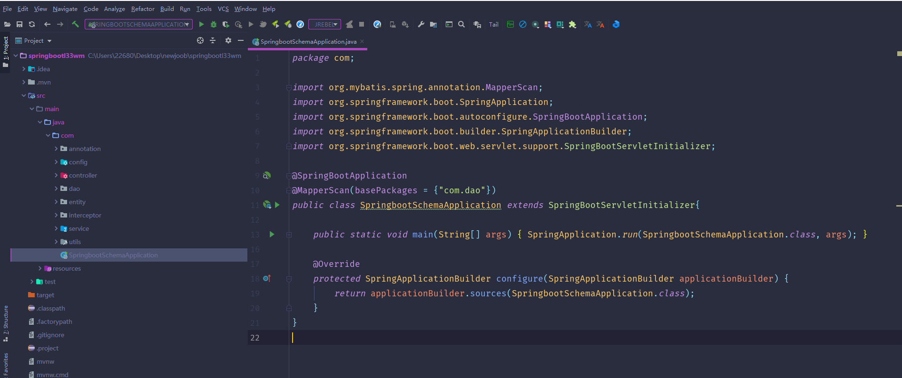
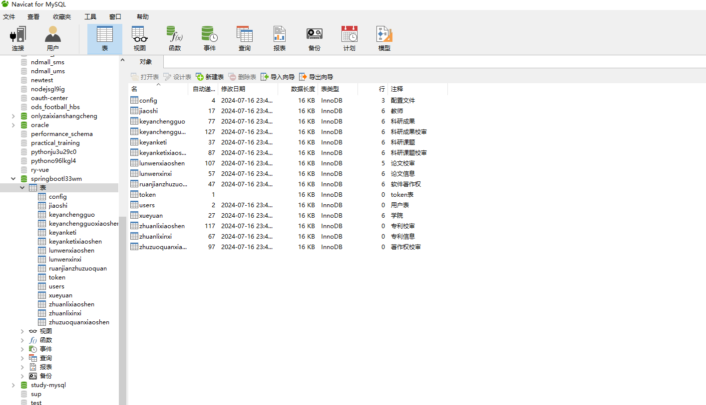
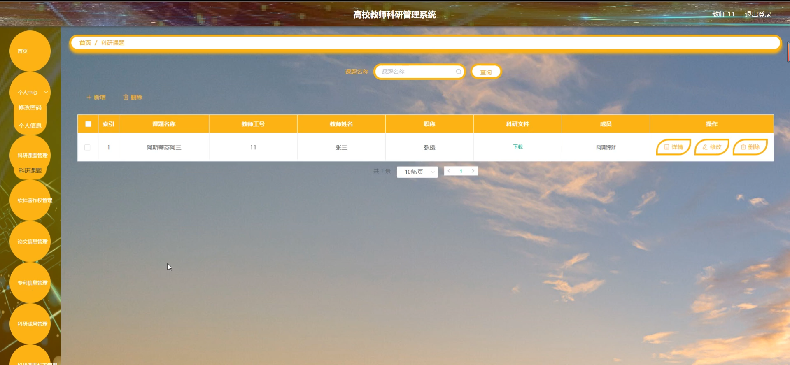
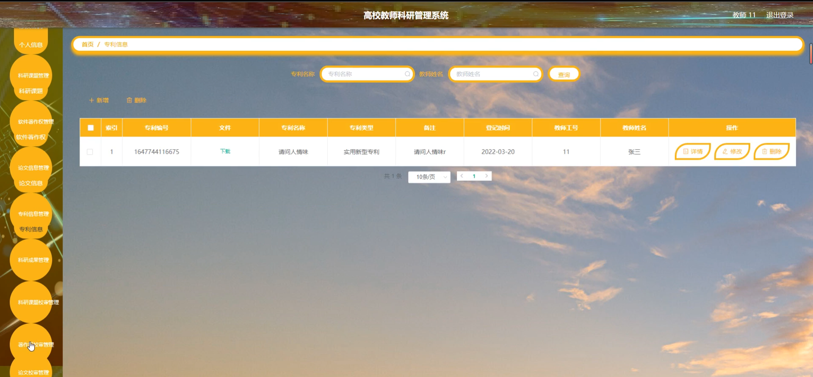
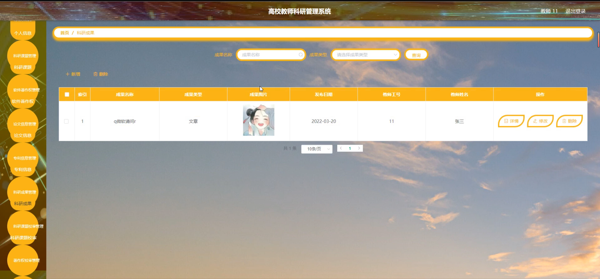
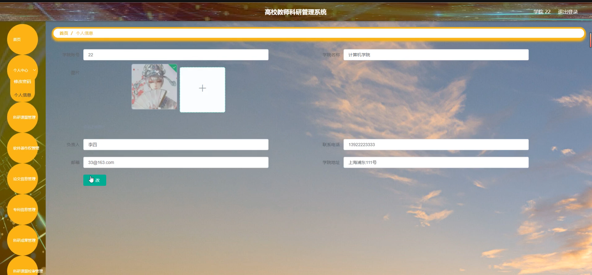
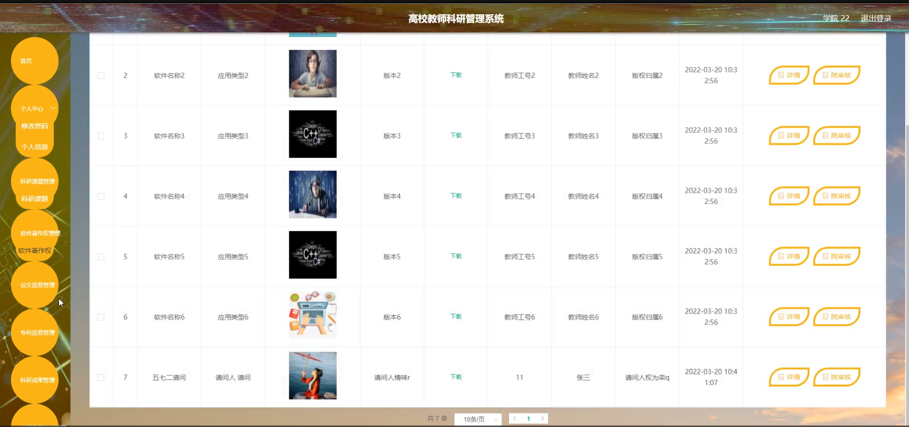
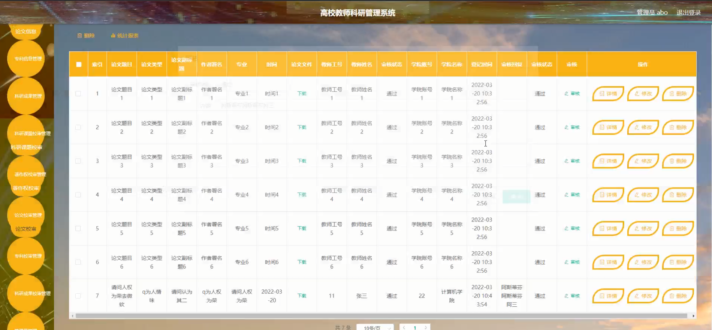
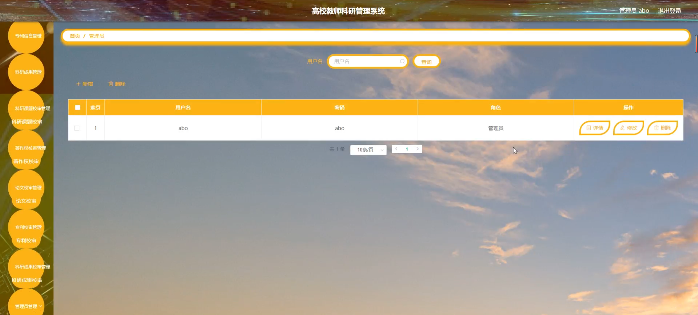

# 基于springboot的高校教师科研管理系统

---
### 👉作者QQ ：1556708905 微信：zheng0123Long (支持定制修改、部署调试、定制毕设)

### 👉接网站建设、小程序、H5、APP、各种系统等

---

#### 介绍

在当前高校科研管理日益复杂和精细化的背景下，高校教师科研管理系统的开发显得尤为重要。随着高校科研活动的不断增加，科研项目的增多，以及科研成果的多样化，传统的人工管理方式已经无法满足高效、准确的管理需求。因此，开发一个基于Spring Boot的高校教师科研管理系统，旨在实现科研管理的自动化、信息化和智能化，提高管理效率，促进科研成果的产出和转化。

本系统针对高校科研管理的实际需求，设计了三种角色：管理端、学院端和教师端，以满足不同层级的管理和使用需求。通过角色划分和权限控制，实现了科研管理的分层、分权操作，提升了管理的灵活性和便捷性。

#### 技术栈

后端技术栈：Springboot+Mysql+Maven

前端技术栈：Vue+Html+Css+Javascript+ElementUI

开发工具：Idea+Vscode+Navicate

#### 系统功能介绍

 管理端功能模块  
个人中心：管理员可以管理个人信息，包括修改密码、查看个人科研信息等。   
学院管理：管理员可以对各个学院进行增删改查操作，包括学院信息的维护和学院用户的权限分配。  
科研课题管理：管理员可以发布、审核、修改和删除科研课题，对课题的进度和状态进行跟踪。  
软件著作权管理：管理软件著作权的申请、审核和登记，确保著作权的合法性和有效性。  
论文信息管理：管理教师发表的论文信息，包括论文的题目、作者、发表时间等。  
专利信息管理：管理教师的专利申请和授权情况，跟踪专利的进展。  
科研成果管理：对教师的科研成果进行登记、审核和统计，方便成果的评价和奖励。  
科研课题校审管：对科研课题进行校级审核，确保课题的科学性和可行性。  
著作权校审管理：对软件著作权进行校级审核，保护学校的知识产权。  
论文校审管理：对教师的论文进行校级审核，确保论文的质量和学术水平。  

学院端功能模块  
个人中心：学院用户可以管理个人信息，包括修改密码、查看个人科研信息等。  
科硏课题管理：学院用户可以查看和管理本学院的科研课题，包括课题的进度和状态。  
软件著作权管理：管理软件著作权的申请和审核，确保本学院著作权的合法性和有效性。  
论文信息管理：管理本学院教师发表的论文信息，方便论文的统计和评价。  
专利信息管理：管理本学院教师的专利申请和授权情况，跟踪专利的进展。  
科研成果管理：对本学院的科研成果进行登记和审核，方便成果的评价和奖励。  
科研课题校审管理：对本学院的科研课题进行院级审核，确保课题的科学性和可行性。  

教师端功能模块  
个人中心：教师可以管理个人信息，包括修改密码、查看个人科研信息等。  
科硏课题管理：教师可以查看和申请科研课题，提交课题进展和成果。  
软件著作权管理：教师可以申请软件著作权，查看申请状态和进度。  
论文信息管理：教师可以登记发表的论文信息，包括论文的题目、作者、发表时间等。  
专利信息管理：教师可以申请专利，查看专利的申请和授权情况。  
科研成果管理：教师可以登记科研成果，提交成果审核和评价。  
科研课题校审管理：教师可以查看科研课题的校审状态和反馈意见。  

#### 系统作用

本系统通过信息化手段，实现了高校教师科研管理的全面自动化和智能化，大大提高了管理效率，减少了人工操作的错误和遗漏。具体作用如下：

提高管理效率：系统实现了科研管理的自动化和流程化，减少了人工操作的环节，提高了管理效率。  
增强科研透明度：系统记录了科研活动的全过程，增强了科研管理的透明度，方便监督和审计。  
促进科研成果转化：系统对科研成果进行了全面的登记和管理，方便了成果的评价和奖励，促进了成果的转化和应用。  
提升科研质量：系统通过校级和院级的课题审核和论文审核，确保了科研课题的科学性和论文的学术水平，提升了整体的科研质量。  

#### 系统功能截图

代码结构

数据库表

登录

教师端个人信息

科研课题管理

论文信息管理

专利信息管理

科研成果管理

论文审核管理

学院端个人信息

软件著作权管理

管理员端论文校审管理

管理员管理

#### 总结

在当前高校科研活动日益复杂和多样化的背景下，传统的科研管理方式已经无法满足高效、准确的管理需求。本研究针对这一现状，开发了一个基于Spring Boot的高校教师科研管理系统，实现了科研管理的自动化、信息化和智能化。系统通过三种角色的划分和详细的功能模块设计，满足了不同层级的管理和使用需求，提高了管理效率，增强了科研透明度，促进了科研成果的转化和应用。本研究不仅填补了高校科研管理信息化领域的空白，还为后续的研究和实践提供了有益的参考和借鉴。

#### 使用说明

创建数据库，执行数据库脚本 修改jdbc数据库连接参数 下载安装maven依赖jar 启动idea中的springboot项目

后台地址
http://localhost:8080/springbootl33wm/admin/dist/index.html

管理员  abo 密码 abo